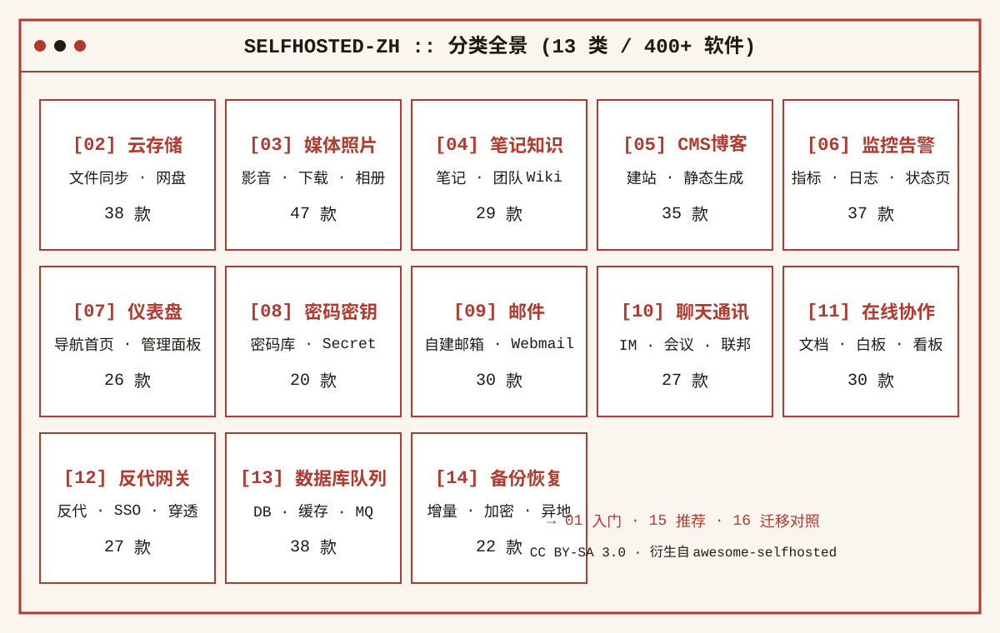
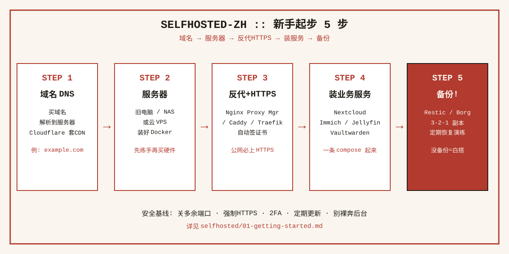
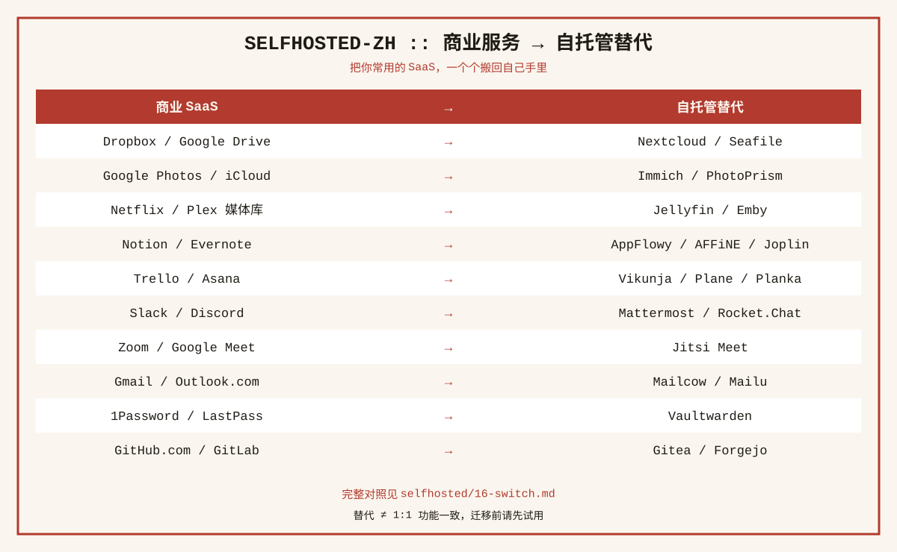

<div align="center">

# 🏠 自托管服务导航 · 中文版

### **400+ 个自托管软件，把你的数据从云上拿回来。**

参考 32 万星上游 [awesome-selfhosted](https://github.com/awesome-selfhosted/awesome-selfhosted) 的分类体系，用**原创中文**重新整理：从网盘、相册、影音，到笔记、监控、反向代理、备份——一个家里/自己服务器上就能跑起来的数字生活清单。

[](./LICENSE)
[](#分类速查表)
[](#)

</div>

> **本仓库为 [awesome-selfhosted](https://github.com/awesome-selfhosted/awesome-selfhosted) 的中文衍生整理，按 CC BY-SA 3.0 发布。**
> 软件名 / 链接 / 许可证为事实信息，中文说明均为原创撰写；详见 [`THIRD_PARTY_NOTICES.md`](./THIRD_PARTY_NOTICES.md)。

---

## ✨ 为什么要自托管

- 🔒 **数据归你**：照片、文档、密码、聊天不再锁在大厂云里；
- 💰 **不被订阅绑架**：一次搭好，不再为空间/功能按月付费；
- 🛠️ **完全可控**：想怎么改怎么改，没有"公司停服说没就没"；
- 🎓 **顺便学运维**：Docker、反向代理、HTTPS、备份，一次上手终身受用。

## 🗂️ 分类速查表

> 共 **13 大类 · 400+ 个**真实可自托管的开源软件。

| # | 分类 | 条数 | 入口 |
| --- | --- | --- | --- |
| 01 | 🚀 入门指南（是什么 / 怎么开始 / 安全基线） | — | [阅读](./selfhosted/01-getting-started.md) |
| 02 | ☁️ 云存储与文件同步 | 38 | [进入](./selfhosted/02-cloud-storage.md) |
| 03 | 🎬 媒体与照片管理（影音/下载/相册） | 47 | [进入](./selfhosted/03-media.md) |
| 04 | 📝 笔记与知识库 | 29 | [进入](./selfhosted/04-notes.md) |
| 05 | 🌐 CMS 与博客 | 35 | [进入](./selfhosted/05-cms-blog.md) |
| 06 | 📊 监控与告警 | 37 | [进入](./selfhosted/06-monitoring.md) |
| 07 | 🧭 仪表盘与导航首页 | 26 | [进入](./selfhosted/07-dashboard.md) |
| 08 | 🔐 密码管理与密钥保管 | 20 | [进入](./selfhosted/08-password.md) |
| 09 | 📧 邮件服务 | 30 | [进入](./selfhosted/09-mail.md) |
| 10 | 💬 聊天与通讯 | 27 | [进入](./selfhosted/10-chat.md) |
| 11 | 🤝 在线协作（文档/白板/看板） | 30 | [进入](./selfhosted/11-collaboration.md) |
| 12 | 🚪 反向代理与网关 | 27 | [进入](./selfhosted/12-proxy-gateway.md) |
| 13 | 🗄️ 数据库与消息队列 | 38 | [进入](./selfhosted/13-db-queue.md) |
| 14 | 💾 备份与恢复 | 22 | [进入](./selfhosted/14-backup.md) |
| 15 | ⭐ 新手推荐清单（第一次装什么） | 12 | [进入](./selfhosted/15-recommended.md) |
| 16 | 🔁 商业服务迁移对照 | 25+ | [进入](./selfhosted/16-switch.md) |

## 👣 入门三步

```
  ①  选机器/硬件   →   ②  域名+DNS+反代+HTTPS   →   ③  装服务 + 做备份
  (旧电脑/NAS/VPS)      (Nginx Proxy Manager / Caddy)      (Docker Compose)
```

完整讲解见 [01 · 入门指南](./selfhosted/01-getting-started.md)，新手首选清单见 [15 · 推荐清单](./selfhosted/15-recommended.md)。

## ⭐ 为什么给本仓点个星

- 🇨🇳 **全中文**：一句话说清"这软件干嘛的、能替代哪个商业产品"，不用硬啃英文 README；
- ✅ **只收真实可自托管**：每条都附官网/GitHub 链接与开源许可证标注；
- 🧭 **分类即路线图**：从入门到数据库/反向代理，一路逛到底就是一套完整知识；
- 📜 **合规开源**：CC BY-SA 3.0，你也可以自由翻译、再分发（保留署名即可）。

## 🖼️ 仓库信息图

| 分类全景 | 新手起步 | 商业替代对照 |
| --- | --- | --- |
|  |  |  |

## ⚖️ 许可与署名

- 本仓库（README、selfhosted/ 中文整理内容、assets/ 图）以 **[CC BY-SA 3.0](./LICENSE)** 发布；
- 参考自 [awesome-selfhosted/awesome-selfhosted](https://github.com/awesome-selfhosted/awesome-selfhosted)（约 32 万星，同样 CC BY-SA 3.0）；
- 各软件自身的开源许可证（MIT/Apache/GPL 等）以其官方仓库为准。

## ⚠️ 免责声明

- 整理时间：**2026-10**。条目链接指向各软件官网/GitHub，链接有效性以官方为准；
- 软件是否仍在维护、是否仍可自托管，请在使用前再次确认官方状态；
- 本清单不构成对任何软件安全性、可用性的保证，自托管风险自担。

---

<div align="center">

**如果这个清单帮到了你，欢迎 ⭐ Star 支持一下，让更多人把数据拿回自己手里。**

</div>
